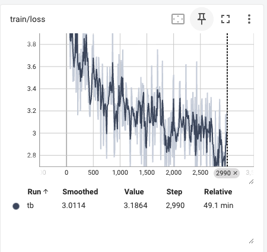

# Multimodal VLM: Implementation + FSDP Scaling Study

[Companion post: A VLM, FSDP, and the Lie My Strong-Scaling Numbers Told Me](https://hectopascal.github.io/blog/2026/vlm-fsdp-strong-scaling/)

**Stack:** PyTorch · HuggingFace transformers · PEFT (LoRA) · accelerate · FSDP · torch.profiler · 8×V100

**Part 1**: Built a tiny VLM from scratch — SigLIP-2-base vision encoder
+ Qwen2.5-0.5B language model + 2-layer MLP projector. Implemented the
image-token splice operation by hand and trained on 50K LLaVA-Pretrain
samples on a single GPU.

**Part 2**: Scaled to multi-GPU with FSDP using a larger 1.5B LM, ran strong-scaling 
sweep across 2/4/8 V100s with activation checkpointing comparison and
profiler-driven bottleneck analysis.

## TL;DR

- Built a vision-language model from scratch (SigLIP-2 + Qwen2.5-0.5B + MLP projector)
  with hand-implemented image-token splice
- Scaled to multi-GPU with FSDP, 
  ran strong-scaling sweep across 2/4/8 V100s
- Found superlinear scaling (5.80× over 2-GPU baseline at 8 GPU) was an artifact
  of memory pressure at the 2-GPU baseline; activation checkpointing recovers
  honest near-linear scaling (4.07× = 102% of ideal)
- Profiler-driven attempt to fix the comms-bound regime via fsdp_forward_prefetch
  achieved the trace-level overlap but didn't improve throughput, likely due to
  V100 NVLink bandwidth contention
  

## Part 1: VLM Implementation 
Architecture: Implemented modular tiny VLM with SigLIP-2-base + Qwen2.5-0.5B + 2-layer MLP projector, trained on 50K LLaVA-Pretrain samples, single GPU. Implemented splice / multimodal data prep from scratch.

Training: 
1. Pretraining to align features/projector. 
2. Joint training with LoRA.

Inference Results:
Stage 1 produces short, on-topic but generic captions consistent with limited training data.

Findings: 
- VLMs don't need new architecture, the LM treats image embeddings as just more tokens. Splice is the runtime operation that replaces the `<image>` bookmark token in the text sequence with N image patch embeddings, so the LM sees one continuous sequence with image content where the bookmark was. The projector just learns to produce vectors that look like token embeddings.
- Projector trains at more aggressive/larger LR than the LM due to the different param counts and different init.
- Stage 1 trains the projector to produce LM-compatible embeddings before stage 2 unfreezes the LM, and skipping stage 1 means stage 2 wastes its budget re-learning alignment.

## Part 2: Scaling to multi-GPUs with FSDP

Setup: Same architecture from stage 1, except I'm using Qwen2.5-1.5B for the LM this time. Training with full LLaVA-Pretrain dataset. The project was originally planned for A100s, alas I couldn't find a machine to use at reasonable prices. As such I ran on 8x V100s instead.

Experiment Notes:
- V100 doesn't have native fp16 matmul throughput the way A100/H100 do. The "speedup from mixed precision" is much smaller. 
- V100 NVLink topology in 8-GPU configs is usually a hybrid cube-mesh, not the all-to-all NVSwitch you get on A100/H100. i.e comms scaling should look worse on V100
- 8-GPU runs were collected across two pod sessions on different days, possibly contributing to the wider variance observed for 8gpu_ckpt (CoV 7.7% vs 1-4% for other configs).
- PEFT initializes LoRA in fp32 by default while the base LM was in fp16; FSDP requires uniform dtype within each shard. Sledge-hammered the model with `self.to(dtype)` to align everything to fp16.
- Hit a non-obvious bug where attention kernel errored with mismatched key dimensions (224 vs 448  exactly 2× query length). Investigation shows it's likely a stale KV cache symptom. Default use_cache=True was caching across batches even in training mode; the FSDP+PEFT wrapping seems to defeat HF's auto-disable. `use_cache=False` fixed it.

Activation checkpointing tradeoff:
1. The 2-GPU baseline is memory-bound. (12.94 GB / 16 GB peak utilization) Allocator pressure makes additional GPUs look more impressive than they are.
2. Activation checkpointing relieves the pressure. 2-GPU memory drops to 9.93 GB; strong-scaling efficiency at 8 GPU drops from 145% (artificially inflated) to 102%, essentially perfect linear.
3. The throughput cost grows with GPU count: 4% / 20% / 33% at 2/4/8 GPU. Recompute is per-step compute; comms grows with world size, so recompute becomes a larger fraction of step time at higher GPU counts. 

With more memory headroom in the baseline (e.g. on A100 80GB), I'd expect classical sub-linear scaling around 70-85% efficiency without needing checkpointing as a workaround.

## Profiling
### Trace (No ckpt)

Initial profiling on the 8-GPU no-ckpt config reveals comms-bound behavior: the NCCL all-gather stream runs continuously while the compute stream sits idle in gaps between layers. This is consistent with V100's lack of NVSwitch. All-gather across the hybrid NVLink mesh takes longer than the per layer compute it enables, so each layer's compute serializes on the previous gather completing.

### Trace (No Ckpt, with prefetch)

Activating the textbook fsdp_forward_prefetch=True produced the comms overlap visible in the trace: NCCL all-gathers became back-to-back rather than gapped. However, throughput across 4 runs was 3059 ± 99 tok/s, slightly below the no-prefetch baseline of 3164 ± 59 tok/s. The two distributions overlap (combined uncertainty ~115 tok/s), so the difference is at best statistical noise and at worst a small regression.

Likely explanation: V100's NVLink topology lacks NVSwitch and provides limited cross-rank bandwidth. Prefetch schedules layer N+1's all-gather while layer N's gather is in flight, but if both contend for the same bandwidth-constrained channels, the second gather slows the first rather than overlapping with compute. Prefetch is a clear win on A100/H100 with NVSwitch; on V100 with this model size, it doesn't help.

## Run-to-run variance 
CoV was 0.1-3.9% across 2-4 repeats per config (no-ckpt). The largest effects in this study (5.8× scaling, 4-33% ckpt overhead) are well above the noise floor. Smaller effects, eg. the impact of fsdp_forward_prefetch=true on 8-GPU throughput, were within run-to-run variance and significance could not be confirmed without more runs. 

## Limitations and future work
Main limitation was the GPU availability. Given more time and resources, I would
- Run on A100s with bf16 instead of V100s with fp16 — V100 lacks native bf16 and the lack of NVSwitch limits all-gather bandwidth at 8-GPU. 
- Add tensor parallelism to compare against pure FSDP at this scale, and I'd profile with Nsight Systems for kernel-level analysis instead of just torch.profiler