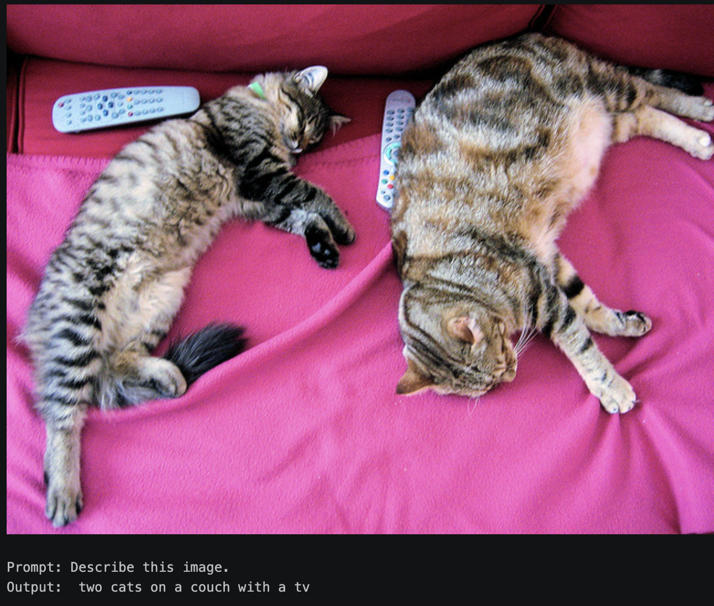
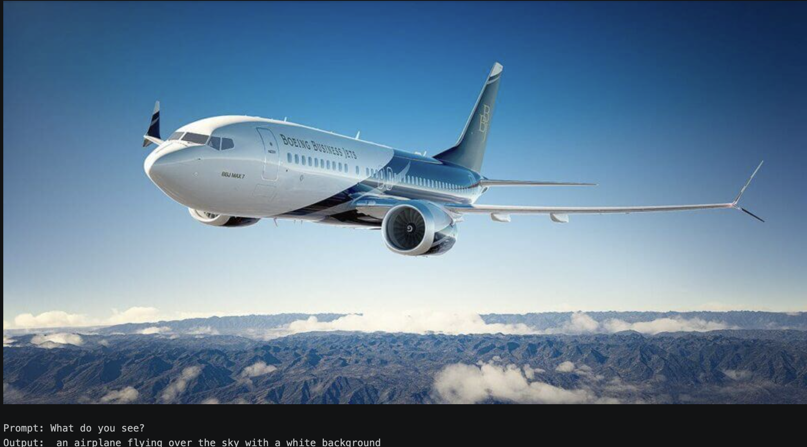
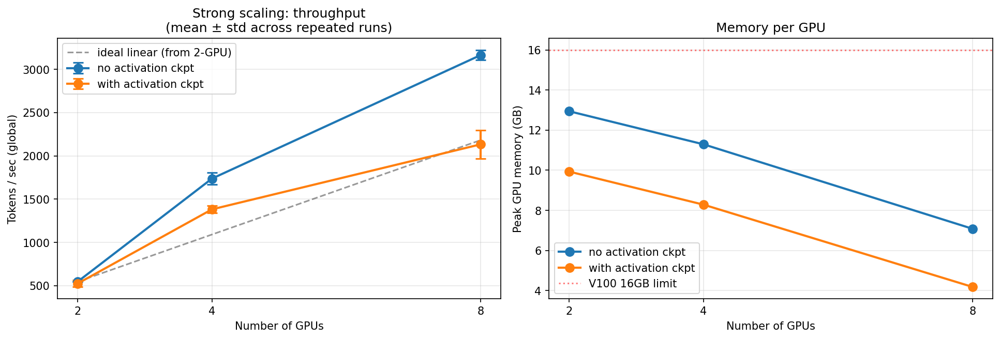

# tinyvlm-implementation

A weekend project: built a vision-language model from scratch and ran a multi-GPU 
FSDP scaling study on it.

📝 **Full writeup:** [VLM + FSDP strong scaling](https://hectopascal.github.io/blog/2026/vlm-fsdp-strong-scaling/)

## TL;DR

- Tiny VLM from scratch: SigLIP-2-base + Qwen2.5-0.5B + 2-layer MLP projector,
  hand-implemented image-token splice, trained on 50K LLaVA-Pretrain samples
- Scaled the pipeline to a 1.5B LM with FSDP across 2/4/8 V100s, 
  ~3K tok/s at 8 GPU
- Found superlinear scaling (5.80×) was a memory-pressure artifact at the 2-GPU
  baseline; activation checkpointing recovers honest near-linear scaling (4.07×)
- Profiler-driven attempt at `fsdp_forward_prefetch` achieved trace-level 
  comms overlap but didn't move throughput (likely V100 NVLink contention)







## Repo structure
```
tinyvlm/              # Part 1: VLM model, data, training
fsdp_study/           # Part 2: FSDP training + sweep + profiling
configs/              # YAML configs for each run
plots/                # Scaling plot, traces, sample outputs
```
## Running it

**Part 1 (single GPU):**
```bash
python -m tinyvlm.train configs/stage1_pretrain.yaml
```

**Part 2 (multi-GPU FSDP sweep):**
```bash
bash fsdp_study/run_sweep.sh
python fsdp_study/analyze.py  # produces plots/scaling.png
```

## Stack

PyTorch · HuggingFace transformers · PEFT (LoRA) · accelerate · FSDP · torch.profiler

Full analysis, traces, and discussion in the [blog post](https://hectopascal.github.io/blog/2026/vlm-fsdp-strong-scaling/).